# Genuary23

## Prompts

|   Day   |                       Promp                      |                                              Comments                                              |                                   Credit                                    |
| :-----: | ------------------------------------------------ | -------------------------------------------------------------------------------------------------- | --------------------------------------------------------------------------- |
|  **1**  | Perfect loop / Infinite loop / endless GIFs      | [Examples of perfect loops on Giphy](https://giphy.com/search/perfect-loop) TIP, use ffmpeg to turn a bunch of PNG frames into an MP4: `ffmpeg -r 30 -i "frame%04d.png" -pix_fmt yuv420p -movflags +faststart perfectloop.mp4` | [arikwex](https://github.com/arikwex) [Reva](https://twitter.com/Reva_fyw) |
|  **2**  | Made in 10 minutes                               | [Made in 10 minutes](https://www.google.com/search?hl=en&q=timer%2010%20minutes)                   | [Daniel Simu (hapiel)](https://twitter.com/Hapiel)                          |
|  **3**  | Glitch Art                                       | [Wikipedia: Glitch Art](https://en.wikipedia.org/wiki/Glitch_art)                                  | [generetame](https://twitter.com/generateme_blog)                           |
|  **4**  | Intersections                                    |                                                                                                    | [Yazid](https://twitter.com/Yazid)                                          |
|  **5**  | Debug view                                       |                                                                                                    | [jenslabs](https://twitter.com/jenslabs)                                    |
|  **6**  | Steal Like An Artist                             |                                                                                                    | [Daniel Catt](https://twitter.com/revdancatt)                               |
|  **7**  | Sample a color palette from your favorite movie/album cover |                                                                                         | [Luca](https://twitter.com/ioan1x)                                          |
|  **8**  | Signed Distance Functions                        | [Piter explains how to SDFs](https://genuary.art/wtsdf) [2D distance functions by Inigo Quilez](https://iquilezles.org/articles/distfunctions2d/) [3D distance functions by Inigo Quilez](https://iquilezles.org/articles/distfunctions/) [Wikipedia: Signed Distance Functions](https://en.wikipedia.org/wiki/Signed_distance_function) | [Camille Roux](https://twitter.com/camillerouxart) |
|  **9**  | Plants                                           |                                                                                                    | [Lionel Radisson](https://twitter.com/MAKIO135)                             |
|  **10** | Generative music                                 | [Wikipedia: Aleatoric music](https://en.wikipedia.org/wiki/Aleatoric_music)                        | [Steve Pikelny (scyclow)](https://twitter.com/steviepxyz)                   |
|  **11** | Suprematism                                      | [Wikipedia: Suprematism](https://en.wikipedia.org/wiki/Suprematism)                                | [Eric Davidson]( https://twitter.com/TheBuffED)                             |
|  **12** | Tessellation                                     | [Wikipedia: Tesselation](https://en.wikipedia.org/wiki/Tessellation) [Wikipedia: List of Tesselations](https://en.wikipedia.org/wiki/List_of_tessellations) | [Devi](https://twitter.com/deviparikh) |
|  **13** | Something you've always wanted to learn          |                                                                                                    | [huminaboz]( https://twitter.com/huminaboz)                                 |
|  **14** | Aesemic                                          | [Dictionary: Asemic](https://dictionary.cambridge.org/us/dictionary/english/asemic) [Wikipedia: Asemic writing](https://en.wikipedia.org/wiki/Asemic_writing) | [Melissa Wiederrecht]( https://twitter.com/mwiederrecht) |
|  **15** | Sine waves                                       | [Fun with sine waves: 1D wobbly noise](https://www.desmos.com/calculator/nhbzwkhij3)               | [Jess Hewitt](https://twitter.com/rustysniper1), [Yazid](https://twitter.com/Yazid) |
|  **16** | Reflection of a reflection                       |                                                                                                    | [Ryan](https://twitter.com/keisans)                                         |
|  **17** | A grid inside a grid inside a grid               |                                                                                                    | [Andrea Diotallevi]( https://twitter.com/adiotalleviart)                    |
|  **18** | Definitely not a grid                            |                                                                                                    | [Daniel Simu (hapiel)]( https://twitter.com/Hapiel)                         |
|  **19** | Black and white                                  |                                                                                                    | [Lionel Radisson](https://twitter.com/MAKIO135)                             |
|  **20** | Art Deco                                         | [Wikipedia: Art Deco](https://en.wikipedia.org/wiki/Art_Deco)                                      | [Artefakt (Artefakt7)](https://twitter.com/artefakt_7)                      |
|  **21** | Persian Rug                                      | [Wikipedia: Persian carpet](https://en.wikipedia.org/wiki/Persian_carpet)                          | [arikwex]( https://github.com/arikwex)                                      |
|  **22** | Shadows                                          |                                                                                                    | [Luca]( https://twitter.com/ioan1x)                                         |
|  **23** | More Moiré                                       | [Wikipedia: Moiré](https://en.wikipedia.org/wiki/Moir%C3%A9_pattern)                               | [Daniel Simu (hapiel)]( https://twitter.com/Hapiel)                         |
|  **24** | Textile                                          |                                                                                                    | [Daniel Simu (hapiel)]( https://twitter.com/Hapiel)                         |
|  **25** | Yayoi Kusama                                     | [Wikipedia: Yayoi Kusama](https://en.wikipedia.org/wiki/Yayoi_Kusama) [Image search: Yayoi Kusama](https://duckduckgo.com/?q=yayoi+kusama&ia=images&iax=images) | [Anna Lucia]( https://twitter.com/annaluciacodes) |
|  **26** | My kid could have made that                      |                                                                                                    | [Melissa Wiederrecht]( https://twitter.com/mwiederrecht)                    |
|  **27** | In the style of Hilma Af Klint                   | [Hilma af Klint: List of works](https://www.wikiart.org/en/hilma-af-klint/all-works#!#filterName:all-paintings-chronologically,resultType:masonry) | [Roni]( https://twitter.com/KaufmanRoni) |
|  **28** | Generative poetry                                |                                                                                                    | [Roni]( https://twitter.com/KaufmanRoni)                                    |
|  **29** | Maximalism                                       |                                                                                                    | [Steve Pikelny (scyclow)](https://twitter.com/steviepxyz), [Yazid](https://twitter.com/Yazid) |
|  **30** | Minimalism                                       |                                                                                                    | [Steve Pikelny (scyclow)](https://twitter.com/steviepxyz), [Yazid](https://twitter.com/Yazid) |
|  **31** | Deliberately break one of your previous images, take one of your previous works and ruin it. | Alternatively, remix one of your previous works.       | [Alex Naka](https://twitter.com/gottapatchemall), [RalenArc](https://twitter.com/RalenArc) |

## Planning

```mermaid
gantt
	title Genuary23
    excludes    2023-01-10,2023-01-11,2023-01-17,2023-01-18,2023-01-24,2023-01-25,2023-01-31,2022-12-30,2023-01-06,2023-01-14
	dateFormat  YYYY-MM-DD
	Develop artwork  1               : done     ,     d01,     2022-12-22,     2d 
	Develop artwork  2               : done     ,     d02,     2022-12-23,     1d 
	Develop artwork  3               : done     ,     d03,     2022-12-24,     1d 
	Develop artwork  4               : done     ,     d04,     2022-12-25,     1d 
	Develop artwork  5               : done     ,     d05,     2022-12-28,     1d 
	Develop artwork  6               : done     ,     d06,     2022-12-28,     1d 
	Develop artwork  7               : done     ,     d07,     2022-12-28,     1d 
	Develop artwork  8               : active   ,     d08,     2022-12-29,     8d 
	Develop artwork  9               : done     ,     d09,     2022-12-31,     1d 
	Develop artwork 10               : done     ,     d10,     2023-01-03,     3d 
	Post promp  1                    : milestone,     p01,     2023-01-01,     0d 
	Develop artwork 11               : done     ,     d11,     2022-12-31,     2d 
	Post promp  2                    : milestone,     p02,     2023-01-02,     0d 
	Develop artwork 12               : done     ,     d12,     2023-01-02,     1d 
	Post promp  3                    : milestone,     p03,     2023-01-03,     0d 
	Develop artwork 13               : done     ,     d13,     2023-01-08,     1d 
	Post promp  4                    : milestone,     p04,     2023-01-04,     0d 
	Develop artwork 14               : done     ,     d14,     2023-01-09,     1d 
	Post promp  5                    : milestone,     p05,     2023-01-05,     0d 
	Develop artwork 15               : done     ,     d15,     2023-01-12,     1d 
	Post promp  6                    : milestone,     p06,     2023-01-06,     0d 
	Develop artwork 16               : done     ,     d16,     2023-01-13,     3d 
	Post promp  7                    : milestone,     p07,     2023-01-07,     0d 
	Develop artwork 17               : done     ,     d17,     2023-01-15,     1d 
	Post promp  8                    : milestone,     p08,     2023-01-08,     0d 
	Develop artwork 18               : done     ,     d18,     2023-01-15,     1d 
	Post promp  9                    : milestone,     p09,     2023-01-09,     0d 
	Develop artwork 19               : done     ,     d19,     2023-01-05,     1d 
	Post promp 10                    : milestone,     p10,     2023-01-10,     0d 
	Develop artwork 20               : done     ,     d20,     2023-01-19,     1d 
	Post promp 11                    : milestone,     p11,     2023-01-11,     0d 
	Develop artwork 21               : done     ,     d21,     2023-01-20,     1d 
	Post promp 12                    : milestone,     p12,     2023-01-12,     0d 
	Develop artwork 22               : done     ,     d22,     2023-01-20,     1d 
	Post promp 13                    : milestone,     p13,     2023-01-13,     0d 
	Develop artwork 23               : active   ,     d23,     2023-01-21,     1d 
	Post promp 14                    : milestone,     p14,     2023-01-14,     0d 
	Develop artwork 24               :                d24,     after d23 ,     1d 
	Post promp 15                    : milestone,     p15,     2023-01-15,     0d 
	Develop artwork 25               :                d25,     after d24 ,     1d 
	Post promp 16                    : milestone,     p16,     2023-01-16,     0d 
	Develop artwork 26               : done     ,     d26,     2023-01-03,     1d 
	Post promp 17                    : milestone,     p17,     2023-01-17,     0d 
	Develop artwork 27               :                d27,     after d25 ,     1d 
	Post promp 18                    : milestone,     p18,     2023-01-18,     0d 
	Develop artwork 28               :                d28,     after d27 ,     1d 
	Post promp 19                    : milestone,     p19,     2023-01-19,     0d 
	Develop artwork 29               :                d29,     after d28 ,     1d 
	Post promp 20                    : milestone,     p20,     2023-01-20,     0d 
	Develop artwork 30               :                d30,     after d29 ,     1d 
	Post promp 21                    : milestone,     p21,     2023-01-21,     0d 
	Develop artwork 31               :                d31,     after d30 ,     1d 
	Post promp 22                    : milestone,     p22,     2023-01-22,     0d 
	Post promp 23                    : milestone,     p23,     2023-01-23,     0d 
	Post promp 24                    : milestone,     p24,     2023-01-24,     0d 
	Post promp 25                    : milestone,     p25,     2023-01-25,     0d 
	Post promp 26                    : milestone,     p26,     2023-01-26,     0d 
	Post promp 27                    : milestone,     p27,     2023-01-27,     0d 
	Post promp 28                    : milestone,     p28,     2023-01-28,     0d 
	Post promp 29                    : milestone,     p29,     2023-01-29,     0d 
	Post promp 30                    : milestone,     p30,     2023-01-30,     0d 
	Post promp 31                    : milestone,     p31,     2023-01-31,     0d 
```

## Idees

* **Promp 24**: 
* **Promp 25**: 
* **Promp 27**: 
* **Promp 28**: 
* **Promp 29**: 
* **Promp 30**: 
* **Promp 31**: 
