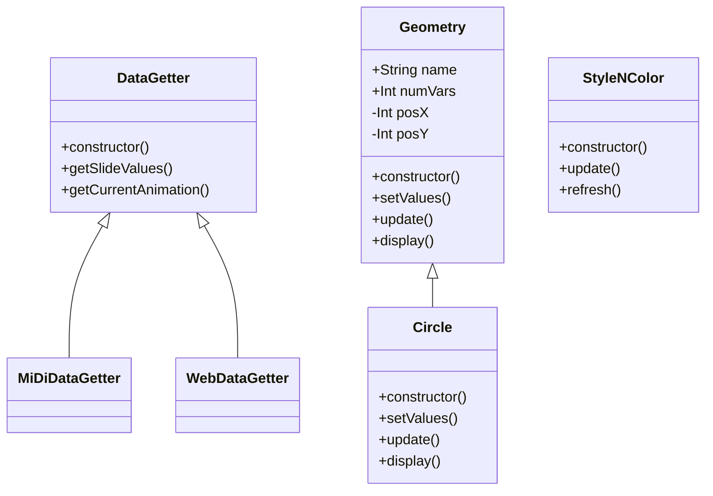

# Recursive Geometry

<style>n{color:#0080ff;font-family:"Segoe Print"}</style>

<small>Visit: https://markralovna.github.io/gallery/geo/</small>

La geometria sacra mola per si sola, però si és recursiva, mola més.

## Descripció

La idea és poder admirar i jugar amb figures que m'agraden i m'inspiren.

Aquest projecte està inspirat en la 2a pràctica de l'assignatura *Entorns Interactius*, la qual consistia a fer una animació controlada amb un MiDi. És a dir, calia que els usuaris pogués controlar l'animació de la pantalla a través del controlador MiDi.

Per aconseguir-ho, cal que les animacions tinguin paràmetres i aquest es recullin de les dades retornades del controlador.

## Estètica

Les regles d'estètica general:

* Fons: `12`
* Linies de les figures:
	* **Color**:
		* To: canvia gradualment a cada *frame*
		* Saturació: `80`
		* Brillentor: `70`
	* **Gruix**: `6`

## Detalls tècnics

Per poder interactuar bé amb les animacions sense un teclat MiDi, el programa té dues opcions: recollir les dades des de web o recollir-les des de MiDi.

### Estructura de fitxers:

```css
geo
├── js
│   ├── DataGetter
│   │   ├── midi.js
│   │   └── web.js
│   ├── Geometry
│   │   ├── ...
│   ├── p5js
│   │   ├── ...
│   ├── sketch.js
│   └── StyleNColor.js
├── index.html
└── README.MD
```

### Interfícies

Per aconseguir que el programa carregui diferents animacions amb dades de diferents entrades, es treballa amb interfícies. L'estructura de classes és la següent:

<n>↓↓↓ Repassar ↓↓↓</n>



### Programa principal

L'sketch principal no fa gaire feina. L'estructura és la següent:

* Declaració de constants i variables.
* `setup()`
	* Inicialització de les variables per les dimensions del canvas.
	* Creació del canvas.
	* Configuració del *framerate*.
	* Inicialització de les figures.
	* Inicialització del *DataGetter*.
	* Inicialització del *StyleNColor*.
* `draw()`
	* Recollida de valors del *DataGetter*.
	* Recollida de l'animació seleccionada del *DataGetter*.
	* Actualització de color del *StyleNColor*.
	* Actualització de valors a l'animació.
	* Mostra l'animació.

#### Estètica (`StyleNColor`)

L'estètica de les figures està vinculada al color i el gruix (`strokeWeight`). Per això s'ha creat la classe `StyleNColor` que controla els estils generals per mantenir l'estètica general.

Per altra banda, el color de les figures canvia gradualment a cada frame. Aquest canvi el controla la mateixa `StyleNColor`.

#### Interfície `Figure`

<n>explicar la classe</n>

## Figures

Les figures que s'han creat són les següents:

* **Torus**: cercles distribuits uniformement al voltant d'un cercle central.
	* `Radius` (radi): 
	* `numChildren` (nombre de fills): 
	* `childsInside` (Nombre de fills interns): 
* **Star**: polígon regular on cada node està unit a dos nodes.
	* `dim` (diàmetre): 
	* `childs` (nombre de fills): 
	* `childDistance` (distància entre fills): 
* **Golden Spiral**: l'espiral proporcional al número d'or.
	* `dim` (diàmetre): 
	* `iterations` (iteracions): 
* **Lauburo**: reimaginació del *Lauburo* clàssic.
	* `radius` (radi): 
	* `branches` (branques): 
	* `branchLengh` (longitut de la branca): 
* **Flower of Life**: reimaginació de la *flor de la vida* clàssic.
	* `dim` (diàmetre): 
	* `petals` (número de pètals): 
	* `dimRatio` (relació entre diàmetres): 
* **Metatron's Cube**: reimaginació del *cub de metatron* clàssic.
	* `dim` (diàmetre): 
	* `onionLayers` (Capes al radi): 
* **Moon**: dos cercles interaccionats.
	* `dim` (diàmetre): 
	* `dimRatio` (relació entre diàmetres): 
	* `iniciObertura` (inici de l'obertura): 
	* `desplacamentRatio` (relació entre desplaçaments): 
* **Ones**:  reimaginació del *Ying Yang* clàssic.
	* `dim` (diàmetre): 
	* `childs` (nombre de fills): 
* **Casteljau Triangle**: la mítica corba de *Casteljau* feta amb triangles.
	* `dim` (diàmetre): 
	* `t` (distancia percentual del costat): 
	* `iterations` (iteracions): 
* **Ying Yang**:  reimaginació del *Ying Yang* clàssic.
	* `dim` (diàmetre): 
	* `childs` (nombre de fills): 
* **Snow Flake**: un cristall de neu interactiu.
	* `lenght` (llargaria): llargaria de la branca
	* `angleBetweenBranches` (angle entre branques): 
	* `branches` (número de branques): 
* **Recursive Tree**: <n>...</n>
	* `size` (<n>...</n>): 
	* `theta` (<n>...</n>):  
	* `childRatius` (<n>...</n>):  
* **Sierpinski Carpet**: <n>...</n>
	* `size` (diametre aproximat): 
	* `iteracions` (nivells de recursivitat): 
	* `sides` (número de costats): 

Especificacions:

|       Figura       |      Classe JS      | Nombre de variables |   Origen   | Comentaris |
|--------------------|---------------------|---------------------|------------|------------|
| Torus              | `Torus`             |          3          | Matemàtic  | Fet inicialment per la segona pràctica d'EI |
| Star               | `Star`              |          3          | Matemàtic  | <n>...</n> |
| Golden Spiral      | `GoldenSpiral`      |          2          | Científic  | <n>...</n> |
| Lauburo            | `Lauburo`           |          3          | Basc/Celta | <n>...</n> |
| Flower of Life     | `FlowerLife`        |          4          | Oriental   | <n>...</n> |
| Moon               | `Moon`              |          4          | Maria      | <n>...</n> |
| Ones               | `Ones`              |          2          | <n>...</n> | Nom inventat. Caldria arreglar-ho |
| Polygonal Spiral   | `PolygonalSpiral`   |          3          | Matemàtic/Enginyeria | <n>...</n> |
| YingYang           | `YingYang`          |          2          | Oriental   | <n>...</n> |
| Snow flake         | `Snowflake`         |          3          | <n>...</n> | <n>...</n> |
| Recursive Tree     | `RecursiveTree`     |          3          | <n>...</n> | Copiat dels [exemples de p5js](https://p5js.org/examples/simulate-recursive-tree.html) |
| Sierpiński Carpet  | `SierpinskiCarpet`  |          3          | <n></n>    |            |


## <n>To Do</n>

* [ ] Documentar que hi ha idees a pinterest

### Arquitectura

* [ ] Fer una interfície virtual o una classe mare per:
	* [ ] Data getters
	* [x] Animacions
* [ ] Fer el Data Getter per MiDi

### Figures

#### Arreglar

* [ ] Localitzar comentaris de l'estil `[Aconseguir algorismicament]` i solventar
* [ ] Aconseguir fer que el *Lauburo* sigui recursiu
* [ ] Afegir interaccions al *Ones* i buscar un nom més místic
* [ ] Afegir interaccions al *Ying Yang*

#### Fer

* [ ] Cor