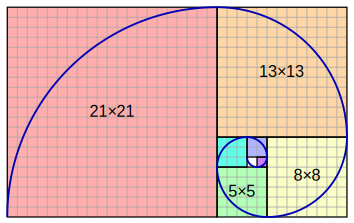

# References

## Figures fetes

### Torus Flower

>In geometry, a **torus** (plural **tori**) is a surface of revolution generated by revolving a circle in three-dimensional space about an axis that is coplanar with the circle. 

This is a depiction of a [Tube](https://en.wikipedia.org/wiki/Torus) Torus figure derived from the [Seed of Life](https://en.wikipedia.org/wiki/Flower_of_Life#Seed_of_Life) (a component of the [Flower of Life](https://en.wikipedia.org/wiki/Flower_of_Life)).

### GoldenSpiral

>In geometry, a **golden spiral** is a [logarithmic spiral](https://en.wikipedia.org/wiki/Logarithmic_spiral) whose growth factor is [φ](https://en.wikipedia.org/wiki/Phi), the [golden ratio](https://en.wikipedia.org/wiki/Golden_ratio). That is, a golden spiral gets wider (or further from its origin) by a factor of φ for every quarter turn it makes. 

### Lauburo

>El tetrasquel o lauburu o creu basca és un dels símbols recents (segle XVI a segle XVIII) de la cultura basca.
>
>El lau buru ("quatre caps" en euskera), és en realitat una esvàstica el nom de la qual prové del llatí labarum, que a la vegada procedeix de l'ensenya càntabra d'origen celta, anomenada làbar. D'aquí la similitud amb l'esvàstica, comuna a tots els pobles indoeuropeus. 

### FlowerLife

Most common form of the "Flower of Life" hexagonal pattern (where the center of each circle is on the circumference of six surrounding circles of the same diameter), made up of 19 complete circles and 36 partial circular arcs, enclosed by a large circle.

### PolygonalSpiral

### YinYang

### RecursiveTree

### SierpinskiCarpet

## Idees de Futur

