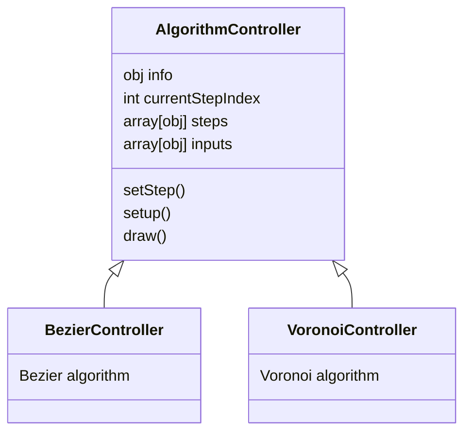
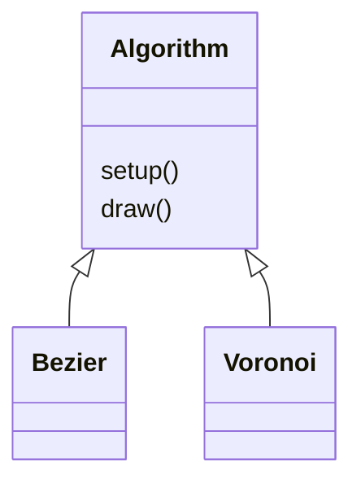

# The Magic School

<style>
	.pendent, .dubte, .millorar { font-family: "Segoe Print" }
	.pendent  { color: #0080FF }
	.dubte    { color: #FF8000 }
	.millorar { color: #FF0080 }
</style>

<small>Visit: https://markralovna.github.io/gallery/school/</small>

> I'm unable to understand an algorithm until I try to implement it by myself.

## Descripció

Hi ha certs algorismes que són famosos en el *mundillo* de l'art generatiu i que és importants conèixer'ls per poder dedicar-se a aquesta disciplina.

En general, em costa entendre un algorisme fins que no intento implementar-lo a la meva manera. Normalment prenc apunts sobre aquests algorismes i tal, però crec que la millor manera de tenir-los present i assegurar-me que els tinc ben interioritzats és fer una app on estiguin recollits.

L'aspiració és que l'app contingui una interfície gràfica que permeti seleccionar un algorisme i et mostri pas a pas com està implementat.

## Disseny

### Disposició de la interfície gràfica

        ╔════════════════════════════════════════════════╗    
        ║ ┌───────────┐  ┌──────────────┐  ┌───────────┐ ║    
        ║ │ ┌───────┐ │  │       2      │  │           │ ║    1 - Canvas
        ║ │ │   4   │ │  └──────────────┘  │           │ ║    2 - Títol
        ║ │ └───────┘ │                    │     3     │ ║    3 - Selector de algorisme (buttons)
        ║ │ ┌───────┐ │                    │           │ ║    4 - Navegador de passos (buttonBar)
        ║ │ │  5    │ │          1         │           │ ║    5 - Controladors per l'algorisme seleccionat (inputs)
        ║ │ └───────┘ │                    │           │ ║    
        ║ └───────────┘                    └───────────┘ ║    
        ╚════════════════════════════════════════════════╝    

### Estètica

<p class="pendent">Colors, strokes, formes...</p>

## Capes (Arquitectura)

¿Com funciona aquesta app per dins?

Per facilitar-me la vida, l'app està dissenyada per diferents capes:


                  /\                      
                 /  \ → Interfície        
                /────\                    
               /      \ → Sketch i View   
              /────────\                  
             /          \ → Controlador d'algorisme
            /────────────\                
           /              \ → Algorisme   
          /────────────────\              
         /                  \ → p5js      
        /____________________\            


Resum de les capes:

* **Interfície**: és la part gràfica i manipulable per l'usuari. Aquesta capa està formada pels fitxers `.html` i `.css` (`index.html`, `styles\estils.css` i `styles\layout.css`).
* **Sketch i View**: el fitxer `scripts/view.js` recull les accions de l'usuari i les passes a les capes inferiors. I el fitxer `scripts/sketch.js` passa les capes inferiors a la capa superior.
* **Controlador d'algorisme**: per cada algorisme seleccionable a l'app, hi ha un controlador que dibuixa.
* **Algorisme**: aquesta capa dibuixa l'algorisme seleccionat amb els càlculs i processos que comporta.
* **p5js**: la *fantabulosa* [llibreria](https://p5js.org/) que fa la màgia.

### <p class="pendent">...</p>

<p class="pendent">ALGORISMICAMENT SEGUIM LA LOGICA. CADA JOC TÉ UN DRAW I UN SETUP.</p>

<p class="pendent">CADA COMPOMEMNT TÉ UN DRAW I UN SETUP. nORMALMENT EL DRAW TÉ UN UPDATE I UN DISPLAY.</p>

<p class="pendent">EL DRAW HA DE GESTIONAR UNA ITERNAIÓ MENTRE QUE EL UPDATE ACTUALITZA COSES I EL DISLAY DIBUIXA</p>

### Interfície

Aquesta capa està creada per HTML i CSS i no té més complicació. Veure l'[apartat de disseny](#disseny) de l'app.

### Programa principal (Sketch i View)

### Sketch

Aques és el fixer bàsic per treballar amb la llibreria `p5js`. Les funcions del fitxer són:

* `setup()` i `draw()`: són les funcions que la llibreria [p5js](https://p5js.org/get-started/) busca.
* `setColor()`: aquesta funció configura el color en que s'han de dibuixar les formes en base certs paràmetres. Així ens assegurem que l'estètica dels colors està centrelitzada aquí.
* `clearCanvas`: simplement, neteja el fons. Així no cal repetir la variable de color.

#### View

Les tasques principals d'aquest fitxer són:

* Crear i actualtzar els elements necessaris al DOM depenent de les necessitats dels algorismes.
* Rebre els esdeveniments de l'usuari i comunicar-ho als controladors.

### Controlador d'algorisme

El controlador d'algorismes ha de servir per comunicar l'objecte que dibuixa l'algorisme amb les accions de l'usuari. Per exemple, si l'usuai ha seleccionat el pas 3, cal que només es dibuixi l'algorisme fins al pas 3 i no l'algorisme complert.

En essència, el controlador d'algorisme (`AlgorithmController`) és un objecte que conté tota la informació teòrica de l'algorisme seleccionat i les eines corresponents.



#### Mètodes

Els mètodes `setup()` i `draw()` serveixen per cridar els mètodes `setup()` i `draw()` de l'algorisme fill. El mètode `setStep()`, serveix què la capa superior li comuniqui quin és el pas actual definit per l'usuari.

#### Atributs

##### `info`

Aquest objecte ha de contenir la informació que pot resultat d'interés per l'usuari:

|        Clau        |         Descripció         |    Tipus    |                     Funció                     |
|--------------------|----------------------------|-------------|------------------------------------------------|
| `name`             | Nom de l'algorisme         | *String*    | És el nom que es mostrarà al títol de l'app    |
| `shortName`        | Nom abreviat               | *String*    | És el nom que es mostrarà al botó del selector |
| `infolink`         | Enllaç amb més informació  | *String*    |                                                |

```js
this.info = {
	name: 'Lorem ipsum',
	shortName: 'Lipsum',
	infolink: 'https://ca.wikipedia.org/wiki/Lorem_ipsum'
};
```

##### `steps`

Aquesta llista conté els *passos* pels quals l'usuari podrà navegar. Cada *pas* és un objecte amb dades:

|        Clau        |         Descripció         |    Tipus    |
|--------------------|----------------------------|-------------|
| `title`            | Breu descrpció del pas     | *String*    |
| `explanation`      | Explicació del pas         | *String*    |
| `displayFunction`  | Funció que executa les funcions necessaries per dibuixar l'algorisme | *Function*  |

```js
this.steps = [
	{
		title: 'Lorem ipsum',
		explanation: 'Dolor sit amet, consectetur adipiscing elit.',
		displayFunction: function() { that.algorithm.displayLipsum() }
	},
	/* ... */
	{
		title: 'In viverra',
		explanation: 'Ac leo nec tincidunt. Suspendisse iaculis elementum turpis vel consectetur',
		displayFunction: function() { that.algorithm.displayViverra(); }
	}
];
```

##### `inputs`

Aquesta llista conté els *controls* amb els quals l'usuari podrà controlar l'algorisme. Cada *control* és un objecte amb dades:

|        Clau        |         Descripció         |    Tipus    |
|--------------------|----------------------------|-------------|
| `type` | Tipus d'*input* | *String* |
| `minStep` | Pas en el que cal mostrar aquest *input* | *int* |
| `label` | Etiqueta d l'input | *Function* |
| `initValue` | Valor per defecte | *String*/*int* |
| `callback` | Funció que es cridarà al *onChange* | *Function* |
| Altres atributs de l'html | Altes atributs que es poden afegir a l'HTML en cas de necessitar-lo |  |

```js
this.inputs = [
	{
		type: 'range',
		minStep: 2,
		label: 'T',
		initValue: 30,
		callback: function(ev) { that.algorithm.setT(ev.target.value) },
		min: 0,
		max: 100
	}
];
```

### Algorisme



Els mètodes `setup()` i `draw()` compleixen les mateixes funcions que les funcions `setup()` i `draw()` del `p5js`:

* `setup()`: s'executa una sola vegada quan l'usuari clica el botó d'algorisme. Serveix per configurar l'algorisme. Per exemple, executar la comanda `angleMode(RADIANS)`.
* `draw()`: s'executa en bucle mentre hi hagi l'algorisme en qüestió seleccionat. Aquesta funció ha de calcular i dibuixar tot el que calgui.

A més, la classe haurà de contenir els *setters* necessaris per poder comunicar-se amb la classe superior i mètodes per dibuixar el resultat separat per passos que puguin ser cridats des del controlador de l'algorisme.

## Estructura de fitxers

Hauria de ser fàcil afegir nous algorismes a l'app, per això s'ha modulitzat per tal que cada algorisme tingui el seu controlador i la seva implementació en un sol fitxer i en un fitxer per ell sol.

```css
/
├── index.html
├── scripts
│   ├── sketch.js
│   ├── view.js
│   ├── algorithms
│   │   └── ...
│   └── p5.min.js
├── styles
└── docs.md
```

## Algorismes

<p class="pendent dubte">Explicar els algorismes que hi ha</p>

## Roadmap

### **Fase 01**: app bàsica

1. Implantar un algorisme senzill:
	* [x] Preparar l'algorisme per *Bezier Curve*.
2. Estructurar l'app per funcionar amb diferents algorismes:
	* [x] Separar les lògiques dels algorismes en classes.
	* [x] Preparar l'arquitectura de l'app.
	* [x] Fer un nou algorisme (per poder seleccionar).
3. Treballar estètica:
	* [x] Dissenyar interficie
	* [x] Fer CSSs
	* [x] Carregar els controladors des de JS
4. Dibuixar l'algorisme per passos:
	* [x] Implementar un selector de passos.
	* [x] Preparar l'arquitectura dels passos per cada algorisme.
	* [x] <span class="millorar">Fer que els sliders apareguin al step que els toca</span>
	* [x] <span class="millorar">Afegir més passos a les corves de bezier</span>
5. Documentar
	* [x] Estructurar la informació
	* [/] Redactar els punts
	* [ ] REDACTAR TEMA ESTÈTICA
	* [ ] Corregir ortogràfia
	* [ ] Repassar

### **Fase 02**: afegir nous algorismes

* [/] *Voronoi Diagram*
* [ ] *Perlin Noise*
* [ ] <span class="millorar">Combinatorix</span> <span class="dubte">¿?</span>
* [ ] *Flow Fields* <span class="dubte">¿?</span>

## Help

* **Bezier curve**:
	* ...
* **Voronoi**:
	* [Building a Voronoi diagram - Khan Academy](https://www.khanacademy.org/computer-programming/building-a-voronoi-diagram/5209320543617024)
	* [Expanding two points - Khan Academy](https://www.khanacademy.org/computer-programming/expanding-two-points/5633866140614656)
