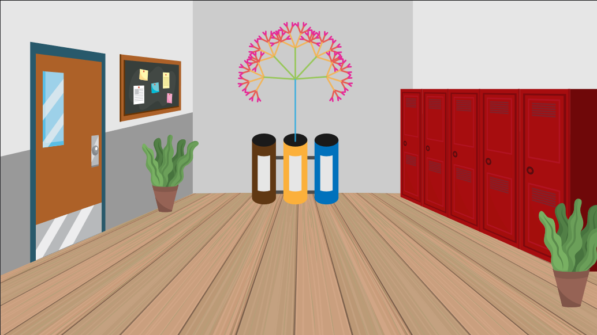
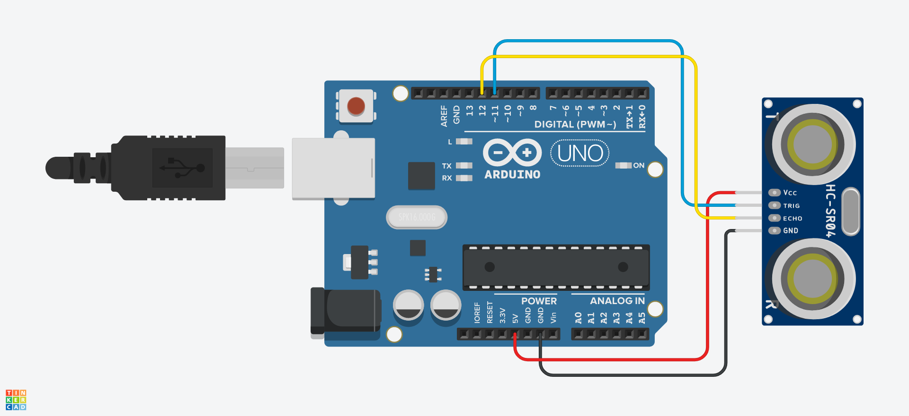

# Arbre Interactiu amb Arduino

<style>n{color:#0080ff;font-family:"Segoe Print"} img { width: 500px }</style>

Projecte desenvolupat per l'assignatura **Entorns Interactius** del grau en **Multimèdia** de la UVic per: Maria Güell, Xavier Moll i Biel Romaní.

## Idea

Es vol crear un arbre que es desenvolupi cada vegada que algú llenci quelcom a les escombraries.

### Projecció

Es projectarà un arbre a una paret blanca davant de les papereres de reciclatge de la universitat. L'arbre patirà lleugeres transformacions cada vegada que es llanci quelcom a les escombraries.



:exclamation: La versió web del programa no està connectada als contenidors, sinó que hi ha tres botons a la interfície de l'HTML.

### Interacció

Quan algú llanci quelcom a les escombraries, l'arbre reaccionarà depenent de la paperera on s'hagi tirat. La següent taula resumeix la interacció:

| Paperera |      Reacció de l'arbre      |
|----------|------------------------------|
| Orgànic  | Li surten més branques       |
| Plàstic  | S'intensifiquen els colors   |
| Paper    | L'arbre creix                |

#### Música

La música serà més/menys hostil depenent de la salut de l'arbre:

* **So vent**: https://www.youtube.com/watch?v=zB-Y5OswETY
* **So ocells cantant**: https://www.youtube.com/watch?v=bKRsCZYZAdc

El volum del so del vent és inversament proporcional a la mida de l'arbre. El volum del so dels ocells ha de ser proporcional a la mida de l'arbre. D'aquesta manera, a mesura que l'arbre es fa gran, el so es va fent agradable.

## Detalls tècnics

### Codi principal

L'estructura del programa principal és:

* Inicialització de variables
* `preload()`
* `setup()`
	* Creació del *canvas*
	* Definició del *framerate*
	* Inicialització de l'arbre
- `draw()`
	* *Update* and *Display*

### Classe Tree

La classe `Tree` és la classe que defineix l'objecte principal del programa: l'arbre. Aquest objecte es construeix dins del `setup()` i se li actualitzen els valors atributs principals a cada iteració del `draw()` on també es redibuixa.

Es redibuixa a través del mètode `Tree.drawTree()` que dibuixa una un tronc i les seves branques de manera recursiva.

#### Atributs:

* **Mida** ( `int[2] size` )
* **Color** ( `int[3] color` ): el to (*hue*) del tronc. La saturació i la brillantor estan fixades. Cada branca té un to lleugerament inferior al del seu pare.
* **Velocitat** ( `float(0-15) vel` ): la velocitat en què canvia el color.
* **Número de branques** ( `int(0-10) numBranches` ): el nombre de branques té el tronc. Les filles tindràn una branca menys a cada generació.
* **Angle entre branques** ( `float(0-2PI) angleBetweenBranches` ): la separació en radians que hi ha entre branques germanes.
* **Diferència de color** ( `float(0-20) colorDiff` ): diferència de color entre generacions de branques.
* **Ratio de llargada de les branques** ( `float(0-1) brLenRatio` ): proporció de les branques filla respecte a la branca mare.
* **Altura** ( `float lenght` ): altura del tronc de l'arbre
* **Transparència del fons** ( `float(0-1) backgroundAlpha` ): transparència del fons (sembla que deixi un rastre per on passa el moviment).

#### Mètodes

* `constructor ( float positionX, float positionY, float maxHeight, int steps ) : void`: constructor.
* `doGrow ( ) : void`: fa créixer una mica l'arbre augmentant l'atribut `lenght`. És el mètode que es crida quan es detecta que s'ha llençat una cosa al contenidor del paper.
* `doColorfy ( ) : void`: intensifica una mica els colors de l'arbre augmentant  la saturació de l'atribut `color`. És el mètode que es crida quan es detecta que s'ha llençat una cosa al contenidor del plàstic.
* `doMakeMoreBranhces ( ) : void`: fa sortir més branques a l'arbre augmentant l'atribut `numBranches`. És el mètode que es crida quan es detecta que s'ha llençat una cosa al contenidor de l'orgànic.
* `doReset ( ) : void`: retorna l'arbre als seus valors originals.
* `update ( ) : void`: a vada iteració del `draw()`, actualitza els valors que calgui a l'animació de l'arbre. A efectes pràctics, augmenta el *hue* de l'atribut `color`.
* `display ( ) : void`: dibuixa l'arbre.
* `drawTree ( float l, int hue, int branches ) : void`: dibuixa una branca de l'arbre de manera recursiva.

<!--

### Circuit (Arduino)

Per poder intereccionar amb l'Arbre des de les escombraries cal sensoritzar els cubells d'escombraries:

#### Circuit



##### Llista de components

| Quantitat |    Component    |
|-----------|-----------------|
|         1 | Arduino Uno R3  |
|         3 | 10 kΩ Resistor  |
|         3 | Photoresistor   |

#### Codi

```cs
//#include <NewPing.h>

//NewPing sensor(11, 12, 200);
int midaContenidor = 20;
int objectNear = -1;
int marge;
int lastDistance;

int readDistance(){
	int echoTime = /*sensor.ping()*/2000;
	int d = /*sensor.convert_cm(echoTime)*/40;
	return d;
}

void checkState() {
	int d = readDistance();
	if(d>0 && d<midaContenidor*3){
		if(d<midaContenidor){
			didObjectPass(0,true);
		} else if(d<midaContenidor*2){
			didObjectPass(1,true);
		} else{
			didObjectPass(2,true);
		}
	} else{
		didObjectPass(-1,false);
	}
}

void didObjectPass(int c, bool movimentDetectat){
	if(movimentDetectat){
		if(objectNear==-1){
			objectNear = c;
		}
	} else if(objectNear>-1){
		Serial.write(char(objectNear));
		objectNear = -1;
	}
}
 
void setup() {
	Serial.begin(9600);
	int d = readDistance();
}

void loop() {
	checkState();
	delay(150);
}
```

### Comunicacio Serie

<n>...</n>

-->
